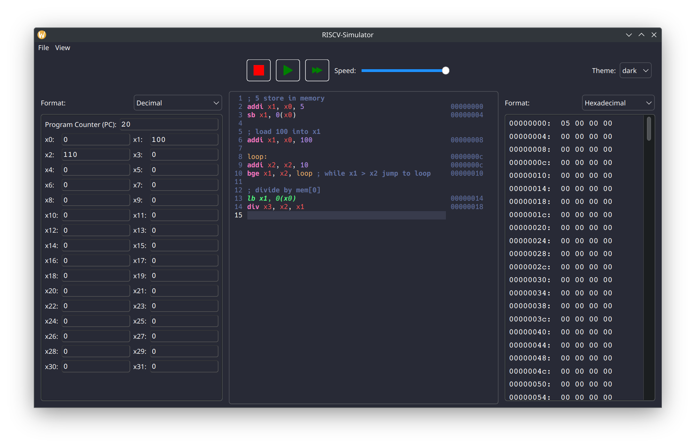
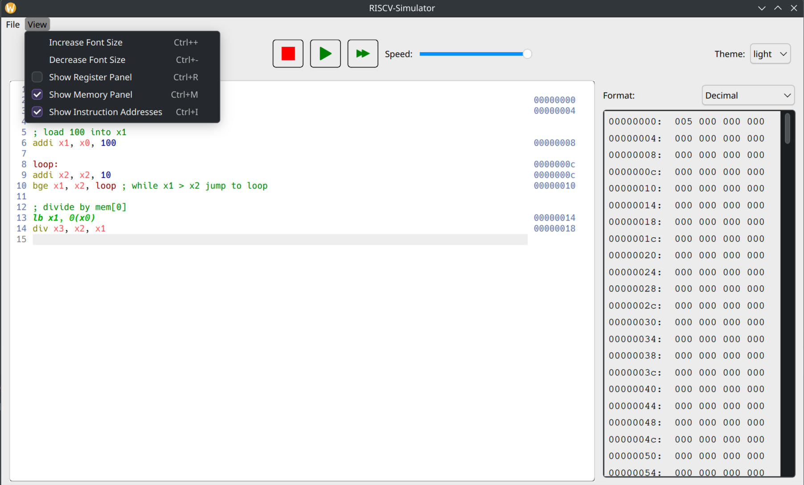

# RISCV-Simulation

Experiment with the RISC-V instruction set based on
the [RISC-V specification](https://riscv.org/wp-content/uploads/2017/05/riscv-spec-v2.2.pdf).

Instruction sets implemented are:

- RV32I (except for the `ecall` and `ebreak` instructions)
- RV32M

See [here](https://msyksphinz-self.github.io/riscv-isadoc/html/index.html) for an overview

## Dependencies

- [Qt](https://www.qt.io/) toolkit
- [QCodeEditor](https://github.com/rafal-tarnow/K-Editor) widget
- [json](https://github.com/nlohmann/json)
